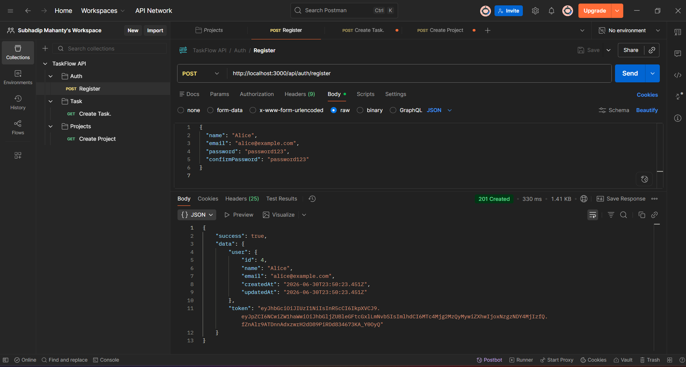
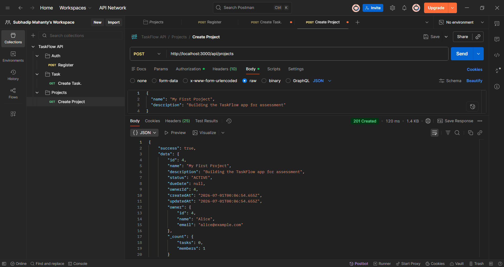
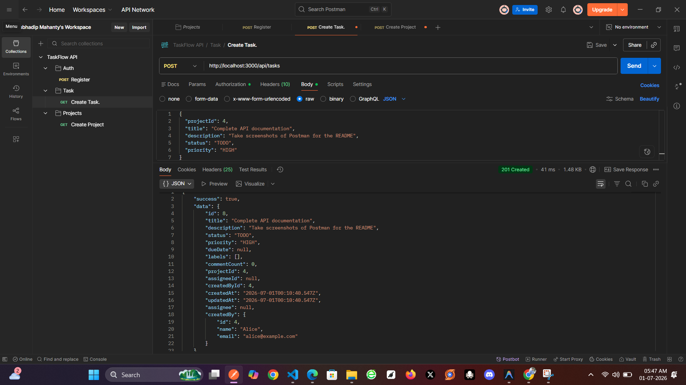

# TaskFlow API Documentation

This document explains what the TaskFlow API does, lists the available endpoints, and includes screenshots of our Postman tests.

---

## Testing Evidence (Postman Screenshots)

Here are the screenshots from Postman showing the main parts of the API working correctly.

### 1. User Registration (`201 Created`)

   

### 2. Project Creation (`201 Created`)

   

### 3. Task Creation (`201 Created`)

   

---

## API Overview

The backend is built with Node.js, Express, and Prisma. The API is split into four main parts:

1. **Authentication:** Handles user sign-up, login, and passwords using JSON Web Tokens (JWT).
2. **Projects:** Allows users to create, view, update, and archive their projects.
3. **Tasks:** Allows users to manage tasks inside projects, update task status, and add comments.
4. **Dashboard:** Pulls summary data (like how many tasks are completed) for the frontend dashboard.

Note: You need to include your Bearer token in the `Authorization` header for all requests except registration and login.

---

## Endpoint Details

### Authentication (`/api/auth`)

* **`POST /api/auth/register`**
  * **What it does:** Creates a new user account and returns a login token.
  * **Required Data:** `name`, `email`, `password`, `confirmPassword`

* **`POST /api/auth/login`**
  * **What it does:** Logs a user in and returns a token so they can use the rest of the API.
  * **Required Data:** `email`, `password`

### Projects (`/api/projects`)

* **`GET /api/projects`**
  * **What it does:** Returns all projects that belong to the logged-in user.
  
* **`POST /api/projects`**
  * **What it does:** Creates a new project. The person who creates it becomes the owner.
  * **Required Data:** `name`, `description`

* **`GET /api/projects/:id`**
  * **What it does:** Gets the details for one specific project, including who is working on it.

* **`DELETE /api/projects/:id`**
  * **What it does:** Archives a project. Only the project owner can do this.

### Tasks (`/api/tasks`)

* **`GET /api/tasks/projects/:id/tasks`**
  * **What it does:** Gets a list of all tasks inside a project.

* **`POST /api/tasks`**
  * **What it does:** Creates a new task inside a project.
  * **Required Data:** `projectId`, `title`, `description`, `status`, `priority`

* **`PATCH /api/tasks/:id`**
  * **What it does:** Updates a single task, like changing its status from "TODO" to "DONE".

* **`PATCH /api/tasks/bulk`**
  * **What it does:** Updates several tasks at once. The frontend uses this when dragging and dropping tasks on the board.
  * **Required Data:** `taskIds` (list of numbers), `status`

* **`POST /api/tasks/:id/comments`**
  * **What it does:** Adds a new comment to a task so the team can talk about it.

### Dashboard (`/api/dashboard`)

* **`GET /api/dashboard/summary`**
  * **What it does:** Gets a quick summary of the user's work, like the total number of active projects and how many tasks are in each status.
